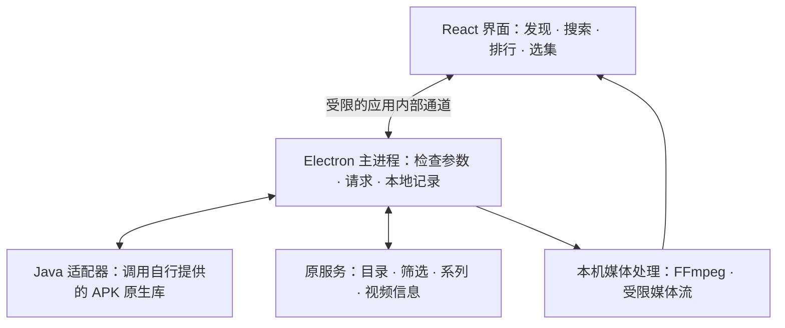

<div align="center">


# HongguoL Desktop

**在电脑上找剧、选集、继续看。**

基于原 APK 的业务与接口，重新制作的独立 Electron 桌面客户端。

   [](LICENSE)

[功能介绍](#features) · [使用方法](#usage) · [构建运行](#build) · [开发历程](docs/DEVELOPMENT.md) · [常见问题](#faq)

</div>

---

> **第一次来，请先看这里**<br>
> 这个仓库公开的是客户端源码，当前版本为 **2.3.4**。运行视频业务还需要自行准备第三方运行资源；只下载仓库、安装 npm 依赖，不能直接得到完整可播放的程序。准备方式见 [Windows 构建说明](docs/BUILD_WINDOWS.md)。本次源码发布没有上传现有完整成品包。

## 阅读导航

| 你想了解什么 | 从这里开始 |
| --- | --- |
| 这个项目是什么、能做什么 | [项目介绍](#overview) · [功能介绍](#features) |
| 怎么找剧、追剧、换集和调整播放 | [使用方法](#usage) · [默认设置](#preferences) |
| 怎么编译、运行和打包 | [构建运行](#build) · [完整构建指南](docs/BUILD_WINDOWS.md) |
| 为什么这样设计、解决过哪些问题 | [版本演进](#history) · [完整开发历程](docs/DEVELOPMENT.md) |
| 哪些功能测过，哪些仍有限制 | [验证与限制](#verification) · [常见问题](#faq) |
| 如何参与、如何保护敏感信息 | [参与开发](CONTRIBUTING.md) · [安全说明](SECURITY.md) |

<a id="overview"></a>

## 01 · 项目介绍

HongguoL Desktop 的目标，是把“刷短剧、找下一部剧、选集接着看”这些操作做成适合电脑使用的界面。

窗口、导航、搜索、详情、选集和播放器由本项目重新编写。剧目、排行榜、筛选选项和视频信息来自原 APK 对应的服务。界面在电脑本地运行，不使用官网页面作为播放界面，也不需要用安卓模拟器显示整个手机应用。

目前聚焦短剧观看流程，没有搬过来 APK 中所有的小说、听书、社区等业务。项目与原应用及其运营方没有隶属关系，源码开放也不代表获得了第三方影视内容或品牌的使用、分发许可。

| 项目状态 | 说明 |
| --- | --- |
| 当前公开源码 | **2.3.4** |
| 当前支持的发布目标 | **Windows x64** |
| 默认打包形式 | **`win-unpacked`**：一个完整程序文件夹 |
| 内容来源 | 原 APK 的服务接口，联网获取 |
| 本地能力 | 偏好设置、追剧、观看记录与续播 |
| 账号与云同步 | 入口保留在设置中，仍有兼容性限制 |
| macOS | 保留历史适配和诊断代码，当前仓库不将其作为已验收的正式发布目标 |
| 开源许可 | 原创源码、适配器、文档和原创标识采用 [MIT](LICENSE) |

<a id="features"></a>

## 02 · 功能介绍

### 找剧：发现、探索、排行和搜索

| 功能 | 使用时的体验 |
| --- | --- |
| **发现** | 首页以视频为主，减少视频下方的额外信息；向下滚动继续浏览推荐，向上可以回到已看过的条目。双击左侧“发现”可刷新推荐。 |
| **探索** | 从热搜、新剧、预约等入口发现内容，再进入独立筛选页。 |
| **排行榜** | 分类、子榜、筛选和排序以原版服务返回为准，支持继续加载；演员与系列剧使用各自的内容逻辑。 |
| **搜索** | 输入剧名或关键词时出现联想，支持键盘选择；结果接近底部时继续加载，相关系列剧放在同一组。 |
| **动态筛选** | 体裁、主题、设定、背景、推荐、受众、时间、长度等行按当次接口配置显示。某些体裁可能增加画风、完结状态等条件，未下发的行不强行补齐。 |
| **两种排列** | 原卡片排列与“一行一部剧”列表可以随时切换，适用于排行、探索、搜索、追剧、记录及演员作品等目录。 |

筛选选项放不下时自动换行，不需要拖动横向长条。切换条件会立即显示选中状态，再等待新结果；服务返回空列表时如实显示空结果。

### 看剧：先了解，再播放

默认点击排行、探索、搜索等页面的剧目，会先打开详情小窗。这里可以查看简介、总集数、系列成员和可选集数，再点击播放。小窗从加载开始就采用稳定尺寸，内容加载出来后不会突然变大。

这个操作也可以在设置中关闭，恢复“点击剧目直接播放”。发现页的刷视频流程独立保留。


### 播放器：尽快响应，保持画面干净

- **清晰度**：默认选本集最高可用档位，也能手动选择；设置中可保存默认档位。
- **倍速和音量**：可调整播放速度、音量和静音；默认值可以保存。
- **进度跳转**：点击或拖动进度条时保留已经解码的画面，新位置准备好后继续播放，不换成剧集封面。
- **切换反馈**：刷下一条时先开始翻动，目标首帧到达就显示，不等整段视频下载完成。动画不会停在半途；若新帧还没到，等待区保持纯黑，不用旧视频冒充新视频。
- **选集反馈**：点击第 41 集，会立即高亮 41 并更新显示集数，再等待视频加载；真正开始播放后才更新对应的观看进度。
- **连续观看**：支持自动下一集，保留当前集数与总集数提示。
- **沉浸播放**：提供常规播放、无边框窗口播放和全屏播放；沉浸状态切集不主动浮出进度条、音量等控件，主动操作时仍可调出。
- **滚动保护**：一个滚动手势默认只触发一次切换；展开选集抽屉或菜单时，滚动用于查看内容，不顺便切换视频。

界面删去多余的授权统计文字，并不代表取消授权。锁定集数、预约剧和服务明确禁止播放的内容，仍保留原版状态。

### 留住想看的剧

在支持的剧目卡片上右键，可以加入追剧；再次右键取消。播放详情里也能点击“追剧”。观看记录用于记住集数和进度，同一系列的不同季分别保存，切季后可以回到各自的位置。

这些首先是**本地数据**：本机出现追剧或观看记录，不等于已经同步到了官方账号。

<a id="usage"></a>

## 03 · 使用方法

| 想做什么 | 操作 |
| --- | --- |
| 换一条推荐视频 | 在发现页常规播放时，上下滚动鼠标 |
| 刷新推荐 | 双击左侧“发现” |
| 在当前剧里切上一集／下一集 | 进入详情播放，或在无边框窗口／全屏播放状态下上下滚动 |
| 查看简介、选集或其他季 | 点击播放器“选集”，在同一面板查看详情、系列和集数 |
| 等待视频时先选中目标集 | 直接点击集数，高亮立即变化 |
| 添加／取消追剧 | 在剧目卡片上右键，或使用详情中的追剧按钮 |
| 改成一行一部剧 | 点击目录上的排列切换图标 |
| 下次启动也使用列表 | 设置 → 浏览 → 默认剧集排列 |
| 修改画质、速度、音量 | 播放器控制栏；常用默认值在设置中保存 |
| 导出排查日志 | 设置 → 诊断与日志 → 导出日志 |

### 三种播放布局

| 布局 | 适合什么情况 | 滚轮行为 |
| --- | --- | --- |
| **常规播放** | 保留应用导航，边找剧边观看；这是默认布局 | 发现页切推荐条目，详情播放切当前剧集 |
| **无边框窗口播放** | 视频铺满当前窗口；再次点击窗口播放按钮恢复 | 切当前剧的上一集／下一集 |
| **全屏播放** | 让视频占据屏幕 | 切当前剧的上一集／下一集 |

选集面板打开后，滚动只用于浏览面板。关闭面板后，视频区域恢复切换操作。返回与剧名保留在相应播放布局中，随播放器控件的显隐规则显示。

> 如果手里已有完整的 `win-unpacked`，请保留整个文件夹，从其中的 `红果 Windows.exe` 启动。只复制 EXE 会缺少运行资源。这个仓库没有附带该完整发行文件夹。

<a id="preferences"></a>

## 04 · 默认设置

设置会自动保存。以下是首次启动时的默认值；已有用户保存的有效设置会继续使用。

| 设置 | 初始值 | 可以怎么改 |
| --- | --- | --- |
| 主题 | 跟随系统 | 浅色、深色、跟随系统 |
| 默认剧集排列 | 卡片排列 | 改为一行一部剧 |
| 点击剧集先查看详情 | 开启 | 关闭后直接进入播放 |
| 首页自动播放 | 开启 | 可关闭 |
| 进入视频自动播放 | 开启 | 可关闭；主动点击播放仍表达播放意图 |
| 自动下一集 | 开启 | 可关闭 |
| 默认清晰度 | 最高可用 | 可指定 360P–2160P 档位；实际档位由本集决定 |
| 默认倍速 | 1× | 0.75×、1×、1.25×、1.5×、2× |
| 默认播放布局 | 常规播放 | 改为无边框窗口播放 |
| 默认音量 | 80% | 0%–100% |

指定清晰度在某一集里不存在时，会向下匹配可用档位。页面内临时切换排列不会改写默认值；想让下次启动沿用，请在设置中修改。

<a id="build"></a>

## 05 · 下载源码、构建与运行

### 第一步：检查公开源码

准备 Git 和 Node.js 24，执行：

```powershell
git clone https://github.com/lhl1/hongguoL-desktop.git
cd hongguoL-desktop
npm ci
npm run build
npm test
```

这一步会按锁文件安装依赖、检查代码、编译界面并运行离线测试。**编译成功不代表已经有完整的视频运行环境。**

### 第二步：准备本地运行资源

目前适配器对应原 APK **`com.phoenix.read` / 7.3.9.32 / 73932**，不同版本不保证直接兼容。

| 资源 | 用通俗的话解释它的用途 |
| --- | --- |
| 可使用的原 APK 与配套 SDK 配置 | 提供原服务要求的原生处理能力；源码不能凭空生成这些专有文件 |
| Windows JDK 17、Maven 3 | 编译本项目的 Java 适配器，生成精简 Java 运行环境 |
| Windows x64 FFmpeg | 处理视频和部分图像格式，输出播放器可以读取的媒体流 |
| 第三方许可与通知 | 准备或分发这些资源时，需要遵守各自条件 |

资源准备脚本、目录结构和参数见 **[Windows 构建说明](docs/BUILD_WINDOWS.md)**。脚本只在项目内准备资源，不需要管理员权限；资源目录已经存在时会拒绝覆盖。

### 第三步：运行和打包

准备好资源后执行 `npm start`。需要生成程序目录时执行 `npm run pack`。

```text
release-2.3.4/
└─ win-unpacked/
   ├─ 红果 Windows.exe
   └─ …其余运行文件必须一并保留
```

默认只生成 Windows x64 文件夹，不生成 NSIS 安装器、portable 单文件或 macOS 包。含第三方资源的成品包需要另行处理分发条件，不应直接作为 MIT 源码附件上传。

### 命令速查

| 命令 | 做什么 |
| --- | --- |
| `npm ci` | 按锁文件安装依赖，保持版本一致 |
| `npm run build` | 检查 TypeScript 并编译界面 |
| `npm test` | 执行合成数据与离线回归测试 |
| `npm start` | 检查本地运行资源，构建并启动客户端 |
| `npm run pack` | 检查资源并生成 `win-unpacked` |
| `npm run test:live` | 使用新游客上下文访问真实接口，输出脱敏摘要 |
| `npm run test:desktop` | 运行隐藏、静音的桌面验证流程 |

后两项需要本地资源并会访问真实服务，通常无需在每次改文档时重复运行。

<a id="architecture"></a>

## 06 · 它是怎么工作的

可以把程序理解成三个部分：**界面负责让你操作，主进程负责检查和请求，媒体部分负责把视频交给播放器。**



Java 适配器使用 unidbg 调用原 APK 的 ARM/JNI 库。这里执行的是原生库需要的局部环境，没有启动完整 Android 系统，也没有嵌入手机模拟器界面。

界面不直接拿到账号密钥和任意网络访问权限。分页上下文留在主进程，页面只拿到受限的继续加载标记；播放地址和密钥不写入观看记录或导出日志。详见 [架构与验证边界](docs/ARCHITECTURE.md)。

| 目录／文件 | 主要内容 |
| --- | --- |
| `src/` | React 页面、播放器交互与样式 |
| `electron/` | 网络、缓存、媒体、IPC 与本地数据保存 |
| `native-adapter/` | 原创 Java JNI 适配器 |
| `scripts/` | 本地资源准备、检查及验证入口 |
| `tests/` | 合成数据、状态与边界测试 |
| `docs/` | 构建、架构与开发过程 |
| `.github/workflows/ci.yml` | 源码构建和离线测试配置 |
| `public/app.svg` | 本项目原创标识，不使用 APK 官方图标 |

<a id="history"></a>

## 07 · 开发是怎样一步步完成的

开发不是把 APK 界面照搬到电脑上，而是反复核对原版业务，再根据实际使用反馈改进桌面交互。

| 阶段 | 主要解决的问题 |
| --- | --- |
| **0.4 基础重建** | 打通新游客注册、请求签名、首页、搜索、目录和真实视频，加入主题与本地续播。 |
| **0.5 沉浸播放** | 清晰度、音量、自动隐藏、连续推荐、保帧跳转、统一选集与窗口播放。 |
| **0.6 连续优化** | 窗口按钮、搜索联想和续页；翻动先响应且不中途停住；排行预填结构，账号入口收进设置。 |
| **macOS 历史适配** | 调查启动签名、媒体源读取、解码器失败和钥匙串提示；Windows 测试不能替代 Mac 实机验收。 |
| **.14 搜索与系列** | 按官方关联整理系列季，保留原顺序和各季独立进度，改善缓存与旧请求处理。 |
| **.15 排行逻辑** | 分开排行与探索分类，补齐演员作品、系列子榜、预约状态和沉浸切集。 |
| **2.3.0 正式界面** | 统一字体、留白、颜色、箭头和播放器，解决菜单叠盖与越界。 |
| **2.3.1 详情预览** | 统一应用内选择菜单，重排详情与选集，默认先预览再播放。 |
| **2.3.2 即时选集** | 点哪一集就立即选中哪一集，把用户选择与实际进度分开。 |
| **2.3.3 官方筛选** | 依据官方截图重新定位正确筛选接口，动态显示筛选行，固定详情小窗尺寸。 |
| **2.3.4 排列与换行** | 筛选项自动换行，增加一行一部剧与默认排列设置，统一筛选页头。 |
| **源码开放** | 整理许可证、文档、适配器与合成测试，排除私人资料和专有运行文件。 |

**完整过程：** [开发历程与关键问题复盘](docs/DEVELOPMENT.md)。逐步解释修改起因、调查发现、最终方案和验证范围，也记录早期方案为什么后来被替换。

<a id="verification"></a>

## 08 · 验证与当前限制

### 测试结果要分开看

| 验证类型 | 已有结果 | 能证明什么 |
| --- | --- | --- |
| **公开源码构建** | 2026-10-09 开源准备时通过 | 代码检查和界面编译正常 |
| **公开版离线测试** | 87 项：86 通过、1 项可选 HEIC 图片测试跳过、0 失败 | 在受控数据下验证解析、状态和边界 |
| **开源适配器在线检查** | 新游客注册、发现、搜索、详情、视频信息接口成功返回 | 新编译适配器能完成实际请求；这次没有验证画面解码播放 |
| **原本地 Windows 2.3.4 工作版** | 87 项自动测试，以及隐藏静音的真实接口／音视频回归通过 | 当时完整资源与 Windows 环境正常，不等于仅克隆源码即可播放 |
| **GitHub 自动检查** | 已提供源码构建与离线测试配置 | 首次发布时未获得运行记录，不把配置存在写成云端测试通过 |

“离线契约测试”就是用事先构造的数据，检查程序会不会正确处理接口格式和状态。它很有用，但不能替代真实短信登录、云同步或视频播放。

### 仍需了解的边界

| 边界 | 当前说明 |
| --- | --- |
| **账号登录与云记录** | 曾有特定 Windows 账号的历史成功验证，后续版本仍有兼容性问题；不保证当前所有账号可用，不用本地记录冒充云同步。 |
| **官方服务变化** | 接口、SDK、风控、授权和内容可能变化；失败、空结果与不可播放状态如实呈现。 |
| **筛选动态更新** | 普通筛选行和选项可随返回更新；整个请求格式或选择规则改变时，仍可能需要代码升级。 |
| **窗口与全屏** | 隐藏测试验证点击通道、状态和布局；没有抢占桌面操作原生全屏，不据此宣称原生行为已全面人工验收。 |
| **macOS** | 保留历史代码与排查经验，不承诺当前公开版 Mac 实机启动和播放通过。 |
| **构建依赖** | 开源时的审计结果和处理原则见 [安全说明](SECURITY.md#构建依赖审计)。 |
| **运行资源** | 不随源码分发，需自行准备并核对版本、许可。 |

<a id="faq"></a>

## 09 · 常见问题

<details>
<summary><strong>下载源码后，为什么还不能直接播放？</strong></summary>

源码没有包含原 APK 的专有库、SDK 配置、完整 Java 运行时和 FFmpeg 成品。先完成 [本地资源准备](docs/BUILD_WINDOWS.md)，再运行 `npm start`。缺失资源时检查脚本会明确报错。

</details>

<details>
<summary><strong>是不是官方网站套壳？是不是需要安卓模拟器？</strong></summary>

界面由本项目用 React 和 Electron 重写，业务使用 APK 对应接口。JNI 适配器调用自行提供的原生库，不启动完整 Android 系统或手机模拟器界面。

</details>

<details>
<summary><strong>“最高可用”为什么不一定是 1080P 或 2160P？</strong></summary>

它指这一集、当前授权下服务提供的最高档位。不同剧集可能不同，不会因为设置里有某个选项就凭空生成对应画质。

</details>

<details>
<summary><strong>点击一集后已经高亮，为什么视频还在等待？</strong></summary>

高亮表示“你选了这一集”，画面表示“已经准备好可以播放的内容”。两者分开，点击就有反馈；播放与记录在目标视频就绪后交接。失败时会提示并回到实际播放状态，晚到的旧请求不能覆盖新选择。

</details>

<details>
<summary><strong>筛选条件不见了，或某个组合没有结果，是坏了吗？</strong></summary>

不一定。筛选行可能随体裁、服务配置和游客环境变化；组合也可能没有匹配内容。客户端显示当次真实配置，不用其他榜单填充。可尝试重置或重试，持续报错时导出脱敏日志排查。

</details>

<details>
<summary><strong>追剧和观看记录会自动同步到手机吗？</strong></summary>

首先保存在这台电脑。账号与同步入口位于设置中，仍有兼容性限制；本机有记录不证明云端已接收，也不保证手机端显示。

</details>

<details>
<summary><strong>macOS 代码为什么还在，现在可以直接发布 Mac 包吗？</strong></summary>

保留历史适配、诊断和测试工作，避免丢失研究。当前正式目标仍是 Windows x64；Mac 的签名、安全策略、ARM64 解码器和窗口行为需要单独实机验证。

</details>

<details>
<summary><strong>排查问题应该提供什么？</strong></summary>

提供版本、Windows 环境、复现步骤、期望结果和实际表现；播放问题可附设置中导出的脱敏日志。提交前再检查，勿公开手机号、验证码、Cookie、token、完整播放地址、密钥或个人路径。参见 [安全说明](SECURITY.md)。

</details>

<a id="license"></a>

## 10 · 开源范围与参与

**开放：** 自行编写的 React/Electron 客户端、Java JNI 适配器、合成测试、辅助脚本、文档和原创矢量素材。

**不公开：** 原 APK、反编译的第三方源码、专有库及配置、官方图标与字体、剧集封面和视频、捕获响应、真实账号／设备资料、日志、截图，以及现有含第三方组件的完整成品包。

原创部分采用 [MIT](LICENSE)。MIT 不覆盖第三方品牌、影视内容、APK 或运行资源，详见 [第三方说明](THIRD_PARTY_NOTICES.md)。

欢迎通过 [Issues](https://github.com/lhl1/hongguoL-desktop/issues) 反馈可复现的问题，通过 Pull Request 改进代码或文档。开始前阅读 [参与开发](CONTRIBUTING.md)：修改前备份，保持授权状态，注明测试范围，不提交私密数据。

---

<div align="center">

[Windows 构建指南](docs/BUILD_WINDOWS.md) · [架构说明](docs/ARCHITECTURE.md) · [开发历程](docs/DEVELOPMENT.md) · [安全与隐私](SECURITY.md)

**HongguoL Desktop · 让找剧和继续观看更顺手。**

</div>
